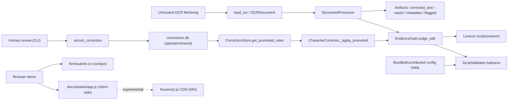

# gurmukhifix Security Design Review / Threat Model

> A security-design review and threat model of the `gurmukhifix` OCR post-processing engine (v0.2.0, MIT). Every control claim below is grounded in a file path (`path:line`) verified against source. Where a control does not exist or is incomplete, that is stated explicitly as a gap or residual risk rather than asserted away.

## Executive summary

`gurmukhifix` is an offline, single-process Python library and CLI that repairs OCR *output* for Gurmukhi and other Indic/Persian scripts. It runs no network service, opens no sockets, and makes no outbound HTTP calls in the reviewed modules (no `requests`/`httpx`/`urllib` imports in `gurmukhifix/*.py`), so the classic network attack surface is small. The security centre of gravity is instead **data integrity of sacred/heritage text**: the worst-case failure is silently rewriting a valid — especially scriptural — word. The strongest existing control is the evidence gate (`gurmukhifix/evidence.py`), which locks verbatim Gurbani word-forms, forbids any edit that worsens script validity, and demands positive evidence (validity gain, dictionary hit, or a human-confirmed context) before any codepoint substitution. Risk is highest when the tool consumes an **attacker-supplied or community-shared `corrections.db`**, when it parses **untrusted ALTO XML / oversized OCR files**, and — for the separate static demo site — in its reliance on a third-party CDN for in-browser OCR. None of the identified issues is a remote-code-execution or credential-theft class defect; the material risks are targeted silent corruption of valid text, denial-of-service via pathological input, and confidentiality/licensing exposure in the corrections log.

### Prioritized findings summary (by severity)

- **High:** TM-001 — poisoned promoted corrections in a shared/attacker-supplied `corrections.db` can silently rewrite a *valid, non-scripture* word into another valid word wherever an attacker-forged context matches (scripture and validity-worsening edits are blocked; the valid→valid context path is the residual).
- **Medium:** TM-002 — the 10-confirmation promotion threshold is forgeable by a single actor in a shared DB; TM-003 — PII / licensed-snippet exposure in the unencrypted SQLite corrections log; TM-005 — entity-expansion ("billion laughs") DoS parsing untrusted ALTO XML via `xml.etree`.
- **Low–Medium:** TM-004 — ReDoS via a pathological config regex, with the timeout guard applied unevenly; TM-006 — resource exhaustion / unguarded parsing of malformed or oversized OCR input; TM-008 — unpinned dependency floors and no committed lockfile (build-time supply chain).
- **Low:** TM-007 — demo supply chain: Tesseract.js is SRI-pinned but its lazily-fetched worker/WASM sub-resources and the Google Fonts CSS are not.

## Scope and assumptions

In scope:

- Core correction pipeline and its safety invariant: `gurmukhifix/evidence.py`, `gurmukhifix/corrector.py`, `gurmukhifix/validator.py`, `gurmukhifix/lexicon.py`, `gurmukhifix/integration.py`.
- Learning/persistence surface: `gurmukhifix/learner.py`, `schema.sql`, and the CLI paths that read/write it (`gurmukhifix/cli.py`).
- Untrusted input parsing: `gurmukhifix/ocr.py` (Tesseract JSON/TSV, hOCR, ALTO XML, Surya, Google Vision) and config loading `gurmukhifix/config.py`.
- The static browser demo under `docs/` (`docs/index.html`, `docs/assets/app.js`, `docs/assets/gurmukhifix.js`).
- Build/dependency posture at a high level: `pyproject.toml`.

Out of scope:

- The OCR engines themselves (Tesseract, Surya, Gemini, Google Vision) and the accuracy of their output.
- Provenance/correctness of the shipped lexicons and per-script YAML rule content (a linguistic-quality concern, not a code-security one) beyond how they are loaded.
- Line-by-line review of every adapter branch and of `diacritic.py` / `ligature.py` (they route through the same evidence gate and `DocumentProcessor._run_pass` validity check, `gurmukhifix/integration.py:83-94`).
- CI/CD internals beyond dependency declaration.

Assumptions:

- Primary deployment is a **local CLI / imported library** run by the operator on their own machine; there is no server, no listener, and no authentication surface.
- Bundled per-script configs in `gurmukhifix/configs/` are trusted code shipped in the wheel; there is **no CLI option to load an external config** (confirmed: `gurmukhifix/config.py:34-39` reads only `configs/<language>.yaml`, and `gurmukhifix/cli.py` exposes no `--config`). A "community-contributed config" therefore enters only via a merged pull request or by editing the installed package.
- A `corrections.db` is trusted only to the extent of its origin. The `--corrections` flag lets an operator point the pipeline at *any* SQLite file, including one authored or shared by a third party.
- OCR input files may be attacker-controlled (e.g. a heritage-digitisation service processing user-submitted scans, or a batch run over a third-party corpus).

Open questions:

- Is a single `corrections.db` ever shared/merged across contributors or committed to a repo, turning the promotion store into a multi-writer trust boundary? (Governs TM-001/TM-002/TM-003.)
- Are ALTO/hOCR inputs ever taken from untrusted third parties at scale rather than from a trusted in-house OCR step? (Governs TM-005/TM-006.)

## System model

### Primary components

- Evidence gate: `EvidenceGate.judge_word` / `judge_edit` — the single per-word rule that authorises or refuses every automatic codepoint change (`gurmukhifix/evidence.py:53-99`).
- Script validator: `ScriptValidator` scores script-validity "badness" and runs config + structural rules with a per-regex timeout (`gurmukhifix/validator.py:35-217`).
- Lexicon / scripture lock: `Lexicon` loads the Gurbani (verbatim scripture) and Punjabi word sets and answers `is_scripture` / `is_word` (`gurmukhifix/lexicon.py:52-86`).
- Corrector: `CharacterCorrector` applies confusion/diacritic and promoted corrections, each through the gate (`gurmukhifix/corrector.py:63-217`).
- Learner / correction store: `CorrectionStore` — SQLite log + aggregate stats, promotes a pair after 10 confirmations (`gurmukhifix/learner.py:25-283`).
- OCR input layer: `load_ocr` + `OCRDocument` adapters normalise Tesseract/hOCR/ALTO/Surya/Vision into word records (`gurmukhifix/ocr.py:83-416`).
- Pipeline orchestrator: `DocumentProcessor` routes by confidence and writes the four output artifacts (`gurmukhifix/integration.py:59-240`).
- Config loader: `load_config` merges `extends:` chains from bundled YAML via `yaml.safe_load` (`gurmukhifix/config.py:34-122`).
- CLI: `correct` / `batch` / `review` / `report` / `demo` (`gurmukhifix/cli.py`).
- Browser demo: a client-side re-implementation plus optional CDN Tesseract.js, served statically from `docs/`.

### Data flows and trust boundaries

- Untrusted OCR file/string -> `load_ocr` -> `OCRDocument`: JSON/XML/HTML/TSV bytes cross into parsers; the whole file is read into memory (`gurmukhifix/ocr.py:392-393`) and dispatched to a format adapter. Mediation is type/shape validation only; there is no size cap.
- `OCRDocument` -> `DocumentProcessor.process` -> artifacts: word records are confidence-routed (`gurmukhifix/integration.py:117-196`); the middle band (60–85%) is corrected, each pass discarded if it worsens validity (`gurmukhifix/integration.py:83-94`). Output is written to `corrected_text.txt`, `correction_report.json`, `metadata.json`, `flagged.json`.
- Every candidate edit -> `EvidenceGate.judge_edit`: the corrector proposes a codepoint change and the gate returns allow/refuse for the single affected word (`gurmukhifix/corrector.py:160-181`, `gurmukhifix/evidence.py:91-99`). This is the core integrity boundary.
- Operator-supplied `corrections.db` -> `CorrectionStore.get_promoted_rules` -> corrector: promoted `(wrong -> correct)` pairs plus their most-common confirmed context flow into `_apply_promoted` (`gurmukhifix/learner.py:196-227`, `gurmukhifix/integration.py:69-72`, `gurmukhifix/corrector.py:185-217`). Mediation is the evidence gate; the DB file's own contents are otherwise trusted.
- Human review -> `CorrectionStore.record_correction` -> SQLite: reviewer text, a 10-char context window, `source_document`, and `reviewer_id` are persisted unencrypted (`gurmukhifix/cli.py:282-289`, `gurmukhifix/learner.py:77-133`).
- Bundled/contributed config YAML -> `ScriptValidator` / `CharacterCorrector`: `impossible_sequences` regex patterns are compiled and executed against text (`gurmukhifix/validator.py:44-52,77-91`; `gurmukhifix/corrector.py:93-96,244-245`). Trust boundary is the code-review/PR process, not runtime input.
- Browser -> static demo -> optional CDN: `docs/assets/app.js` runs the correction logic client-side and, only for the experimental image mode, injects `tesseract.js` from jsDelivr with SRI (`docs/assets/app.js:162-174`). Fonts CSS loads from Google Fonts without SRI (`docs/index.html:15`). The contact form POSTs name/email/message to `formsubmit.co` (`docs/index.html:125,163`).

#### Diagram

## Assets and security objectives

| Asset | Why it matters | Security objective (C/I/A) |
|---|---|---|
| Correctness of scripture (Gurbani) tokens | Silently altering a valid sacred word is the defined worst-case failure; the tool corrects heritage/religious text. | I |
| Correctness of valid non-scripture text | Any silent corruption of already-correct OCR undermines the product's core promise. | I |
| `corrections.db` (log + promoted stats) | Drives future automatic rewrites and stores human-review provenance. | I/C |
| Corrections log contents (context, `source_document`, `reviewer_id`) | May carry manuscript snippets (possibly licensed) and reviewer identity. | C |
| Pipeline availability | A hang or memory blow-up on one pathological input can stall a batch run. | A |
| Bundled configs and lexicons | Define the rules and the scripture lock; corrupting them corrupts the safety invariant. | I |
| Static demo integrity | Compromised client-side code could mislead users or run in their browser. | I |

## Attacker model

### Capabilities

- Supply an OCR input file/string of the attacker's choosing (malformed, oversized, adversarial ALTO/hOCR/JSON) to the CLI or `process_document`.
- Supply or seed a `corrections.db` — either by handing the operator a crafted SQLite file used with `--corrections`, or by writing rows into a shared/community DB the operator later trusts.
- Contribute a malicious YAML config or dependency bump through the normal open-source PR path (supply chain), or tamper with an installed package on a machine they already control.
- For the demo: a network attacker positioned between the browser and the CDN/fonts host, or someone who compromises the jsDelivr/Google Fonts artifact.

### Non-capabilities

- No network/RPC entry point to attack: the core package binds nothing and calls out to nothing (no network imports in `gurmukhifix/*.py`).
- No assumption of pre-existing code execution in the operator's process before crossing one of the input/DB/config boundaries above.
- No assumption of write access to the operator's filesystem beyond files they are already given (the corrections DB, OCR inputs).
- No assumption that the attacker can defeat the OS user/file permissions protecting `corrections.db` at rest.

## Entry points and attack surfaces

| Surface | How reached | Trust boundary | Notes | Evidence (repo path / symbol) |
|---|---|---|---|---|
| OCR file/string ingestion | CLI `--input` / `process_document` / `load_ocr` | Untrusted input -> parser | Whole file read into memory; format auto-detected; no size cap. | `gurmukhifix/ocr.py:352-416`, `gurmukhifix/cli.py:52-96` |
| ALTO XML parsing | `.xml`/`.alto` or `<String`-detected input | Untrusted XML -> `xml.etree` | `ET.fromstring` parses a DOM; entity-expansion DoS possible. | `gurmukhifix/ocr.py:186-207` |
| hOCR / HTML parsing | `.hocr`/`.html` input | Untrusted HTML -> built-in `re` | `re.finditer` over untrusted markup, no timeout guard. | `gurmukhifix/ocr.py:163-183` |
| Promoted corrections | CLI `--corrections <db>` | Operator/shared DB -> corrector | Promoted pairs + context drive automatic rewrites; gated per word. | `gurmukhifix/learner.py:171-227`, `gurmukhifix/corrector.py:185-217` |
| Corrections write | CLI `review` | Reviewer input -> SQLite | Persists text, 10-char context, `source_document`, `reviewer_id`. | `gurmukhifix/cli.py:266-294`, `gurmukhifix/learner.py:77-133` |
| Config regex compile/run | Language selection at load | Bundled/contributed YAML -> regex engine | Patterns compiled from config; timeout on validate, not everywhere. | `gurmukhifix/validator.py:44-52,77-91`, `gurmukhifix/corrector.py:244-245` |
| Config YAML parse | `load_config(language)` | Bundled YAML -> parser | `yaml.safe_load` (no arbitrary object construction). | `gurmukhifix/config.py:34-39` |
| Demo image OCR | Browser "Try image OCR" | Browser -> CDN | Dynamic `<script>` for Tesseract.js, SRI + pinned version. | `docs/assets/app.js:162-174` |
| Demo output render | Browser demo | OCR/clipboard text -> DOM | Rendered via `textContent`, never `innerHTML` (no DOM XSS). | `docs/assets/app.js:78,82-87` |
| Contact form | Browser demo | User PII -> `formsubmit.co` | Third-party form handler; email base64-obfuscated. | `docs/index.html:125,163` |

## Top abuse paths

1. Poisoned promoted correction silently rewrites valid text:
   1. Attacker authors or seeds a `corrections.db` with a promoted pair `(validWordA -> validWordB)` for the target script, plus a `context_before`/`context_after` chosen to match the victim corpus.
   2. Operator runs `gurmukhifix correct --corrections attacker.db`.
   3. `_apply_promoted` proposes the swap; the gate returns `no_evidence` (both words valid, badness 0), but the attacker-supplied context matches, so `accept = ... or promoted.context_matches(...)` fires.
   4. A valid word is silently changed to another valid word wherever the forged 10-char context appears in the 60–85% confidence band.

2. Forged consensus in a shared corrections DB:
   1. Multiple contributors share one `corrections.db`.
   2. A single malicious contributor submits the same `(wrong -> correct)` 10 times (or scripts it).
   3. `correction_stats.count` crosses `_PROMOTION_THRESHOLD` and the pair is promoted — `reviewer_id` is logged but never counted, so there is no distinct-reviewer requirement.
   4. The promoted pair now feeds path 1 for everyone using the DB.

3. Entity-expansion DoS via untrusted ALTO:
   1. Attacker submits an ALTO file whose internal DTD defines nested entities (billion-laughs / quadratic blowup).
   2. `OCRDocument.from_alto` calls `ET.fromstring` on it.
   3. Expat expands the internal entities in memory, spiking CPU/RAM and stalling the run.

4. Resource exhaustion via oversized/malformed input:
   1. Attacker submits a multi-hundred-MB "OCR" file or deeply nested JSON.
   2. `load_ocr` reads the entire file and builds full in-memory structures with no cap.
   3. Memory pressure / recursion errors degrade or crash the batch worker.

5. Demo CDN sub-resource compromise:
   1. Attacker compromises the Tesseract.js worker/WASM artifacts fetched *after* the SRI-pinned entry script, or the un-SRI'd Google Fonts CSS.
   2. Malicious code runs in the demo origin.
   3. Impact is limited because the demo holds no secrets and renders output via `textContent`.

## Threat model table

| Threat ID | Threat source | Prerequisites | Threat action | Impact | Impacted assets | Existing controls (evidence) | Gaps / residual | Recommended mitigations | Detection ideas | Likelihood | Impact severity | Priority |
|---|---|---|---|---|---|---|---|---|---|---|---|---|
| TM-001 | Attacker-supplied or poisoned shared `corrections.db` | Operator runs with `--corrections <db>` pointing at an untrusted/shared DB. | Seed a promoted `(valid -> valid)` pair with matching context to silently rewrite correct text; attempt to rewrite scripture. | Silent corruption of valid — potentially heritage — text; targeted meaning changes. | Scripture correctness, valid-text correctness. | Scripture lock refuses any edit whose *current* word is verbatim Gurbani (`gurmukhifix/evidence.py:71-72`, `gurmukhifix/lexicon.py:76-86`); `worsens_validity` refuses badness-increasing edits (`evidence.py:75-76`); blocking reasons hard-stop promoted edits (`gurmukhifix/corrector.py:200-201`, `evidence.py:39`); word-scoped judgement (`evidence.py:91-99`); context truncated to 10 chars narrows blast radius (`gurmukhifix/learner.py:110-111`). | **Residual (unmitigated):** a valid non-scripture word can still be swapped for another valid word (badness 0->0, `no_evidence`) wherever the attacker-forged `context_matches` holds (`gurmukhifix/corrector.py:202-203`, `gurmukhifix/evidence.py:83-89`). Scripture that is *not a verbatim lexicon member* (variant/mangled) is not locked. | Treat any external DB as untrusted: add a `--trust-corrections` opt-in or provenance/signature check before consuming promoted rules; consider requiring a validity gain OR lexicon hit even for context-scoped promoted swaps (drop the pure valid->valid context path, or flag it for review instead of applying); log every promoted-rule application in `correction_report.json` (already recorded as `rule: promoted_correction`). | Diff pass counts by `rule == promoted_correction`; alert when a promoted edit changes a word the lexicon marks as a known word. | Low-Medium | High | High |
| TM-002 | Malicious contributor to a shared DB | A `corrections.db` written by more than one party is trusted as consensus. | Submit the same pair 10× to force promotion single-handedly. | Fake "confirmed" corrections enter the promoted set, feeding TM-001. | `corrections.db` integrity, valid-text correctness. | Promotion requires `count >= 10` (`gurmukhifix/learner.py:20,154-165`); `reviewer_id` is stored per log row (`learner.py:113,289`). | `correction_stats.count` increments unconditionally on `ON CONFLICT` (`learner.py:121-129`) with no distinct-`reviewer_id` requirement — the threshold is trivially forgeable by one actor or a script. | Count distinct reviewers, not raw submissions, before promoting; or require signed/authenticated review entries in any multi-writer deployment; document that the threshold is an ergonomics feature, not a trust control. | Report promoted pairs whose entire count comes from a single `reviewer_id`. | Medium | Medium | Medium |
| TM-003 | Recipient of a shared/exported corrections DB | A `corrections.db` is shared, committed, or exported. | Read persisted context snippets, source paths, and reviewer identities. | Confidentiality/licensing exposure: fragments of possibly-licensed teeka text, document identifiers, and reviewer PII. | Corrections log contents. | Context stored is capped to 10 chars each side (`gurmukhifix/learner.py:110-111`); `corrections.db` and `.env` are git-ignored by default (`.gitignore`); DB lives outside the package tree (`learner.py:18`). | Data is stored **unencrypted**; `source_document` and `reviewer_id` are stored in full and unbounded (`learner.py:100-118`); no redaction, retention limit, or scrub/export command. | Document that `corrections.db` may contain snippets + PII; add an export/scrub command that drops `source_document`/`reviewer_id`; make `reviewer_id` optional/pseudonymous; consider at-rest permissions guidance. | Review DB for populated `reviewer_id`/`source_document` before sharing. | Medium | Medium | Medium |
| TM-004 | Pathological config-supplied regex | A malicious/careless `impossible_sequences` pattern reaches a config (via merged PR or edited install). | Trigger catastrophic backtracking on crafted input. | CPU hang / DoS on affected documents. | Pipeline availability. | Per-regex `timeout=_REGEX_TIMEOUT` (1.0s) turns a hang into a skipped rule in `ScriptValidator.validate` (`gurmukhifix/validator.py:32,77-81`); configs are bundled-only (no external `--config`); bundled patterns are simple character-class forms (`gurmukhifix/configs/gurmukhi.yaml:133-140`). | The guard is **not uniform**: `CharacterCorrector.validate_sequences` runs the same config patterns via `pat.finditer(text)` with no timeout (`gurmukhifix/corrector.py:244-245`); structural regexes in `_check_orphaned_matras` are unguarded (but fixed, not config-driven). | Route every config-pattern execution through the timeout wrapper (including `validate_sequences`); add a lint/CI check that rejects nested-quantifier patterns in configs. | Log `TimeoutError` skips; time-box per-document processing in batch. | Low | Medium | Low-Medium |
| TM-005 | Untrusted ALTO XML | Attacker-controlled `.alto`/`.xml` fed to `from_alto`. | Supply an internal DTD with nested entity definitions (billion laughs / quadratic blowup). | In-memory entity expansion → CPU/RAM DoS. | Pipeline availability. | Uses stdlib `xml.etree.ElementTree.fromstring` (`gurmukhifix/ocr.py:189`), whose Expat backend does **not** resolve external general entities by default — classic XXE file-read/SSRF is not reachable here; parse errors are caught and re-raised as `ValueError` (`ocr.py:190-191`). | **Residual (unmitigated):** internal entity expansion (billion-laughs/quadratic-blowup) is not defended; the file is fully materialised with no size cap (`ocr.py:392-393`). | Parse ALTO with `defusedxml.ElementTree.fromstring` (forbids DTDs/entities), or configure a parser that disables DTD; enforce an input byte-size cap before parsing. | Alert on parse time/memory spikes; reject inputs containing `<!DOCTYPE`/`<!ENTITY`. | Low-Medium | Medium | Medium |
| TM-006 | Malformed/oversized OCR input | Attacker submits a huge or deeply nested OCR file/string. | Exhaust memory or hit recursion limits during load/parse. | DoS of a worker / batch stall. | Pipeline availability. | Type/shape validation and defensive coercion throughout the adapters (`gurmukhifix/ocr.py:99-116,276-288`); JSON decode errors surfaced as clear `ValueError` (`ocr.py:399-402`); non-numeric confidences tolerated (`gurmukhifix/integration.py:120-122`); batch worker catches `ValueError/OSError` per file (`gurmukhifix/cli.py:131-132`). | No global input-size cap; whole file read into memory (`ocr.py:392-393`); hOCR parsed with un-timeout'd built-in `re` (`ocr.py:168`); deeply nested JSON `RecursionError` is not among caught input errors (`cli.py:39,131`). | Add a configurable max input size and reject oversized files early; consider streaming/iterparse for very large ALTO; include `RecursionError` in the batch/CLI input-error handling. | Log file sizes and per-file processing time; cap and alert. | Low-Medium | Low-Medium | Low-Medium |
| TM-007 | Demo CDN / MITM | User opens the static demo and enables experimental image OCR, or a fonts/CDN artifact is tampered. | Serve malicious JS in the demo origin. | Client-side compromise of the demo page. | Static demo integrity. | Tesseract.js is version-pinned with SRI `integrity` + `crossorigin=anonymous` (`docs/assets/app.js:166-170`); output is rendered via `textContent`, never `innerHTML`, explicitly to prevent XSS (`docs/assets/app.js:78,82-87`); external nav links use `rel="noopener"`. | SRI covers only the entry script; Tesseract.js then lazily fetches its worker/WASM sub-resources from CDN **without** SRI; Google Fonts CSS loads without SRI (`docs/index.html:15`, impractical to pin); contact form trusts `formsubmit.co` with user PII (`docs/index.html:125`). | Prefer self-hosting Tesseract.js + worker/core with local SRI, or pin worker/core paths explicitly; optionally self-host fonts; add a Content-Security-Policy meta/header to constrain script/style origins. | Monitor CDN hashes; watch for CSP violation reports if a CSP is added. | Low | Medium | Low |
| TM-008 | Compromised/typo-squatted dependency (build-time) | A malicious release of `regex`/`PyYAML`/`click` within the allowed floor is installed. | Ship malicious code into the environment at install time. | Environment compromise (build/supply chain, not runtime input). | Dependency integrity. | Config uses `yaml.safe_load`, not `yaml.load` (`gurmukhifix/config.py:39`), so YAML cannot construct arbitrary objects; dependency set is small (3 runtime deps). | Dependencies use `>=` floors with no upper bound and **no committed lockfile** (`pyproject.toml:26-29`), so builds are not reproducible/pinned. | Commit a lockfile (or hash-pinned constraints) for reproducible builds; add Dependabot + a supply-chain scan; consider narrow upper bounds. | CI diff on resolved dependency versions/hashes. | Low | Medium | Low-Medium |

## Criticality calibration

- Critical (none identified): remote code execution, credential theft, or an unconditional silent rewrite of *verbatim scripture* with no operator opt-in. The scripture lock and evidence gate prevent this class in the reviewed code.
- High: a silent-corruption channel for valid text that an attacker can steer with attacker-controlled data the operator opted into (TM-001).
- Medium: forgeable review consensus, confidentiality/licensing exposure in the corrections log, and entity-expansion DoS on untrusted XML (TM-002, TM-003, TM-005).
- Low: availability/robustness hardening of input parsing, uneven ReDoS-guard coverage, demo sub-resource integrity, and build-time dependency pinning (TM-004, TM-006, TM-007, TM-008).

## Focus paths for security review

| Path | Why it matters | Related Threat IDs |
|---|---|---|
| `gurmukhifix/evidence.py` | The single integrity invariant: scripture lock, validity monotonicity, evidence requirement. | TM-001 |
| `gurmukhifix/corrector.py` (`_apply_promoted`, `_PromotedRule.context_matches`) | Where promoted-DB rules meet the gate; the valid->valid context path is the residual. | TM-001, TM-002 |
| `gurmukhifix/learner.py` | Promotion threshold, unconditional count increment, and what the log persists. | TM-002, TM-003 |
| `gurmukhifix/ocr.py` (`from_alto`, `from_hocr`, `load_ocr`) | Untrusted XML/HTML parsing and unbounded file read. | TM-005, TM-006 |
| `gurmukhifix/validator.py` vs `gurmukhifix/corrector.py:244-245` | ReDoS timeout applied in one path but not the other. | TM-004 |
| `gurmukhifix/config.py` | Config trust boundary and safe YAML loading. | TM-004, TM-008 |
| `docs/assets/app.js` | Demo CDN loading, SRI coverage, and XSS-safe rendering. | TM-007 |

## Recommended mitigation roadmap

| Priority | Recommendation | Rationale | Related Threat IDs |
|---|---|---|---|
| P0 | Gate consumption of any external/shared `corrections.db` behind an explicit trust opt-in, and reconsider the pure valid->valid context-only promotion path (require a validity or lexicon gain, or flag-for-review instead of auto-apply). | Closes the one High-severity silent-corruption channel for a sacred-text tool. | TM-001 |
| P1 | Parse ALTO with `defusedxml` (or a DTD-disabled parser) and enforce an input-size cap in `load_ocr`. | Removes the entity-expansion DoS and bounds memory on untrusted input. | TM-005, TM-006 |
| P1 | Promote on distinct reviewers, not raw submission count; document the threshold as ergonomics, not a trust control. | Prevents single-actor forged consensus in a shared DB. | TM-002 |
| P1 | Route all config-pattern execution (including `validate_sequences`) through the `_REGEX_TIMEOUT` wrapper. | Makes ReDoS-guard coverage uniform. | TM-004 |
| P2 | Add a corrections-log scrub/export command and document PII/licensing content; make `reviewer_id` optional. | Limits confidentiality/licensing exposure when a DB is shared. | TM-003 |
| P2 | Self-host or explicitly pin Tesseract.js worker/WASM sub-resources with SRI; add a CSP to the demo. | Extends integrity from the entry script to its lazily-loaded parts. | TM-007 |
| P2 | Commit a lockfile / hash-pinned constraints and add dependency scanning. | Reproducible, auditable builds. | TM-008 |

## Quality check

- Entry points covered: OCR file/string ingestion (JSON/TSV/hOCR/ALTO/Surya/Vision), the promoted-corrections DB path, corrections writes, config regex compile/run, the CLI, and the static demo (CDN load, output render, contact form).
- Every trust boundary appears in ≥1 threat: untrusted-input->parser (TM-005/006), edit->evidence-gate (TM-001), shared-DB->corrector (TM-001/002), reviewer->SQLite (TM-003), config->regex (TM-004), browser->CDN (TM-007), and build->dependency (TM-008).
- Runtime risk (TM-001..007) is kept separate from build/supply-chain posture (TM-008).
- Deployment-dependent risk is explicit: the material threats are conditioned on consuming an untrusted/shared `corrections.db` or untrusted OCR input, and on enabling the experimental demo OCR.
- Control claims were verified against source and cited by file:line; where a control is absent (entity-expansion defense, uniform ReDoS guard, distinct-reviewer promotion, DB encryption) it is marked as a gap/residual rather than asserted. The claim that classic XXE (external-entity/SSRF) is not reachable rests on stdlib `xml.etree`/Expat default behaviour, while internal entity-expansion DoS is flagged as an open residual.
